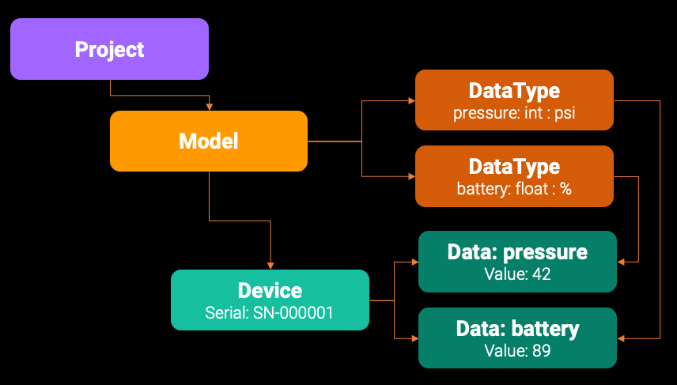

# SimpleIOT Arduino SDK


 


The SimpleIOT Arduino library is an easy way to connect and send/receive data to the cloud via the [SimpleIOT](https://simpleiot.net) framework.

SimpleIOT abstracts out IOT device connectivity and hides the underlying details so you can focus on your application's unique features. 


## Basic Concepts



In the SimpleIOT world, an installation supports the following concepts:

- **Team**: A single installation of SimpleIOT in the cloud. This is mainly relevant to using the Command-Line-Interface (CLI) tool.
- **Project**: Each back-end supports one or more _Projects_.
- **Model**: A _Model_ describes a device's capabilities. For example, what data it likes to exchange with the cloud, whether it is an end-node or a gateway device, what features it supports (storage, encryption, AI/ML, etc), and how it communicates with the cloud.
- **DataType**: A _DataType_ is a single named value that can be exchanged between a device and the cloud. A _Model_ typically has one or more _DataTypes_ associated with it.
- **Device**: A _Device_ represents a single instance of a _Model_. Each device is uniquely identified via its _serial_number_.
- **Data**: A _Data_ element is an instance of a _DataType_ associated with a single _Device_. For example, if a _Model_ defines a _DataType_ named `pressure`, each unique _Device_ will have its own instance of `pressure`. You can get/set values associated with each individual _Device_ instance by name.

_Data_ elements are bi-directional, so changes can be sent from the devices themselves to the cloud or from the cloud back to the device. It is up to the firmware on the device to handle what to do with values received from the cloud.


## Installation

To install the SDK, if using the Arduino IDE, go into the Library Manager and add the library named `simpleiot-arduino`. If using [arduino-cli](https://www.arduino.cc/pro/cli) you can add support as follows:

```
% arduino-cli lib install simpleiot-arduino
```

To install the latest version from this github repo you can use:

```
% arduino-cli lib install --git-url https://github.com/awslabs/simpleiot-arduino.git
```

## Dependencies

The SimpleIOT library relies on the following libraries:

- [ArduinoJson](https://arduinojson.org/)
- [arduino-aws-greengrass-iot](https://github.com/aws-samples/arduino-aws-greengrass-iot)


## Use in Arduino sketch

To use the library, you'll need to include the wifi settings, secret credentials, and header files:

```C
#include "iot-secrets.h"    // NOTE: this contains the certs for the remote service
#include "wifi-settings.h"  // and the local wifi-settings
#include <SimpleIOT.h>      // SimpleIOT SDK header
```

### IOT Secrets

The `iot-secrets.h` files needs to contain the following settings. These will be generated automatically when you create
a SimpleIOT _Device_ instance via the CLI. 

- **SIMPLEIOT_IOT_ENDPOINT**: The endpoint of the IOT service.
- **SIMPLE_IOT_ROOT_CA**: The root CA certificate for the AWS IOT service. These can be found [here](https://docs.aws.amazon.com/iot/latest/developerguide/server-authentication.html#server-authentication-certs).
- **SIMPLE_IOT_DEVICE_CERT**: The IOT Thing device certificate. This can be manually generated and downloaded via the AWS IOT Console, or via the `iot device add` command in the SimpleIOT CLI.
- **SIMPLE_IOT_DEVICE_PRIVATE_KEY**: The IOT Thing device private key. This can be manually generated and downloaded via the AWS IOT Console, or via the `iot device add` command in the SimpleIOT CLI.

Consult `iot-secrets-template.h` for what these fields should contain.


If the code is auto-generated by the CLI, these values are automatically filled out in the code generated by the `iot firmware generate` CLI command. If the device was created via the CLI, a copy of these certificate files can be found in the `~/.simpleiot` directory under the team > project > model > device directory.

### WiFi Credentials

The `wifi-settings.h` file contains the embedded Wifi SSID name and password for the device. These are:

- **WIFI_SSID**: SSID of your WiFi access point.
- **WIFI_PASSWORD**: WiFi password for your access point.

If the code is auto-generated by the CLI, these values are automatically filled out in the generated code if they are passed to the `iot firmware generate` command, either via CLI `--wifi_ssid` and `--wifi_password` parameters or via the `IOT_WIFI_SSID` and `IOT_WIFI_PASSWORD` environment variables.

Consult `wifi-settings-template.h` for what these fields should contain.

### Initializing and using the SDK

You need to define a single global instance of the _SimpleIOT_ class. This is usually placed outside the `setup` and `loop` functions:

````
SimpleIOT* iot = NULL;
````

To use the firmware for a specific device, we recommend also defining the following _#define_ values:

```
#define IOT_PROJECT "{project_name}"            // Project name defined by CLI
#define IOT_MODEL   "{model_name}"              // Model name defined by CLI
#define IOT_SERIAL  "{serial_number}"           // Serial number defined by CLI
#define IOT_FW_VERSION "{firmware_version}"     // Firmware version in the #.#.# semantic version
```

For example:

```
#define IOT_PROJECT "SensorDemo"
#define IOT_MODEL   "SensorDemoDevice"
#define IOT_SERIAL  "SD-0001"
#define IOT_FW_VERSION "1.0.0"
```

You can now initialize the library in your `setup()` function by calling the `create` and `config` methods.

```
  iot = SimpleIOT::create(WIFI_SSID, WIFI_PASSWORD, SIMPLEIOT_IOT_ENDPOINT, 
                          SIMPLE_IOT_ROOT_CA, SIMPLE_IOT_DEVICE_CERT, SIMPLE_IOT_DEVICE_PRIVATE_KEY);

  iot->config(IOT_PROJECT, IOT_MODEL, IOT_SERIAL, IOT_FW_VERSION, onConnectionReady, onDataFromCloud);
```

The `create` method creates an instance of the _SimpleIOT_ class. The values passed are:

- WiFi SSID
- WiFI Password
- AWS IOT Endpoint
- Text of the Root CA certificate
- Text of the AWS IOT Device Certificate
- Text of the AWS IOT Device Private Key

The `config` method can then be used to pass runtime parameters to the SDK. Parameters are:

- _Project_ name
- _Model_ name
- _Device_ (unique) serial number
- Firmware version in [semver](https://semver.org/) MAJOR.MINOR.REV (i.e. 1.2.16) format.
- `onConnectionReady` is a callback that is invoked when the connection with AWS IOT has been established.
- `onDataFromCloud` is a callback handler that is called when data from the cloud is received.

## onConnectionReady

The `onConnectionReady` function can be defined as follows:

```
void onConnectionReady(SimpleIOT *iot, int status, String message) {
...
}

```

The function will be called when the WiFi connection to the cloud has been established and a TLS secure connection has been established to the cloud. It is recommended that no data be sent to the cloud until this method has been called. If any error is encountered, the `status` value will be non-zero and the `message` will attempt to provide a reason for the failure.

## onDataFromCloud

The `onDataFromCloud` function can be defined as follows:

```
void onDataFromCloud(SimpleIOT *iot, String name, String value, SimpleIOTType type)
{
...
}
```

This function is called when a value has changed from the cloud side. The data passed will be the `name` and `value` that changed. You can adjust this value remotely using the SimpleIOT CLI via the following command:

```
iot device set --name {name} --value {value}
```

This value can also be updated via the SimpleIOT REST API.

## loop() function

At the bottom of every Arduino `loop` function, a call to `SimpleIOT::loop` should be made to allow the underlying MQTT networking to send data to the server.

For example:
```
iot->loop();
```

## Sending data to the cloud

Sending a sensor value to cloud is usually done inside the Arduino `loop()` function, where sensor data has been read.

The data can be any of:

- String
- Integer
- Float/Double
- Boolean

These are sent to the cloud via the `set` method. For example:
```
float pressure_value = 23.3;

...

iot->set("pressure", pressure_value);
```
It is assumed that the key value is the same as the _DataType_ associated with this model device. If it is an invalid name, the value is discarded. No error will be returned to the end-device. However, you can monitor and verify the value was received properly in the [AWS CloudWatch](https://aws.amazon.com/cloudwatch/) console.

Different value types can be sent in the form:

```
int set(const char* name, const char* value);
int set(const char* name, int value);
int set(const char* name, float value);
int set(const char* name, double value);
int set(const char* name, bool value);
```

Under the hood, all values are coerced into string form and sent to the cloud using the [MQTT](https://docs.aws.amazon.com/iot/latest/developerguide/mqtt.html) protocol.

## GPS Data

If your device has a GPS sensor attached, you can tag individual readings with location data.  The data on the cloud side is routed to the [Amazon Location Service](https://aws.amazon.com/location/). Amazon Location allows you to map data points, create custom tracking maps, and perform a range of other location-based services.

To send GPS data, you can use the `set` method version and pass _latitude_ and _longitude_ data:

```
iot->set("humidity", humidity, last_lat, last_lng);
```

All value setters support passing lat/long data:

```
int set(const char* name, const char* value, float latitude, float longitude);
int set(const char* name, int value, float latitude, float longitude);
int set(const char* name, float value, float latitude, float longitude);
int set(const char* name, double value, float latitude, float longitude);
int set(const char* name, bool value, float latitude, float longitude);
```

## Monitoring received data

The data sent to the cloud, once received, is routed to a number of destinations:

If the _DataType_ was designated as "show on twin" (the default), it will be rebroadcast via MQTT. This can be monitored:
 
- Via the CLI `iot device monitor` command.
- By subscribing to the MQTT `simpleiot_v1/app/monitor/{project}/{model}/{serial}/#` topic.

The data itself is also saved to:

- The _Data_ table in the Postgres database. Only the latest value is saved here.
- In the DynamoDB table for the installation. All values are kept and time-stamped here.
- Sent to the [Amazonn Timestream](https://aws.amazon.com/timestream/) serverless time-based database. The values can be further monitored and analyzed in a dashboard via [Amazon Managed Grafana](https://aws.amazon.com/grafana/).

## Examples

The examples provided are designed to work with the [AWS IOT EduKit](https://aws.amazon.com/iot/edukit/) device. This is an inexpensive development device based on an Espressif ESP-32 processor. A complete SimpleIOT Starter Bundle with an EduKit device and several peripheral sensors can be purchased from the manufacturer [M5Stack](https://m5stack.com/).

To use the library with the M5Kit you will please set up your Arduino environment [as follows](https://docs.m5stack.com/zh_CN/quick_start/m5core/arduino). More information on the M5Stack Arduino SDK, including device schematics can be [found here](https://github.com/m5stack/M5Core2).

**NOTE**: M5Stack carries two types of ESP32 devices. The first Core device has physical buttons, but the Core2 device (including AWS IOTKit) have slightly different hardware, including a touch-screen. First-generation Core device libraries can be [found here](https://github.com/m5stack/M5Stack) whereas Core2 libraries [are here](https://github.com/m5stack/M5Core2).

The two examples provided are:

- **HelloWorld**: Basic Arduino sketch that sends the values of the built-in EduKit touch-screen buttons to the cloud. The color of the globe can be modified from the cloud using the SimpleIOT CLI.
- **SensorDemo**: A more advanced sketch that reads data from an environmental sensor (pressure, humidity, temperature), a rotary knob, and a GPS receiver. Use of these sensors requires installation of the following third-part libraries:

- ArduinoJson
- MQTT
- FastLED
- TinyGPSPlus-ESP32
- M5Core2
- UNIT_ENV
- UNIT_ENCODER

- A step-by-step workshop using this configuration is available at [SimpleIOT.net](https://simpleiot.net). The arduino-cli toolchain can be installed via the SimpleIOT CLI using:

```
% iot toolchain install
```

This will automatically install `arduino-cli` as well as all the above libraries.


## Security

See CONTRIBUTING for more information.

## License
This project is licensed under the Apache-2.0 License.